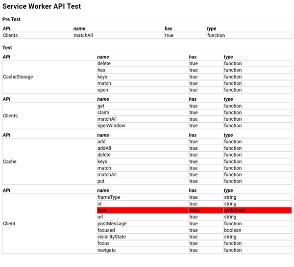

# service-worker-api-test
service-worker-api-test for sw API availability

[Click here to start the test](https://futurist.github.io/service-worker-api-test/static/)

## Install

```sh
npm i service-worker-api-test
```

## Usage

```js
const serviceWorkerApiTest = require('service-worker-api-test')
// return a Promise
serviceWorkerApiTest()
  .then(results=>{
    console.log(results)
  })
  .catch(err=>{
    alert(err)
  })
```

The result in `static/index.html` will be shown below:



The result of the Promise will be:

```json
{
  "pretest": [
    {
      "api": "Clients",
      "result": [
        {
          "key": "matchAll",
          "has": true,
          "type": "function"
        }
      ]
    }
  ],
  "test": [
    {
      "api": "CacheStorage",
      "result": [
        {
          "key": "delete",
          "has": true,
          "type": "function"
        },
        {
          "key": "has",
          "has": true,
          "type": "function"
        },
        {
          "key": "keys",
          "has": true,
          "type": "function"
        },
        {
          "key": "match",
          "has": true,
          "type": "function"
        },
        {
          "key": "open",
          "has": true,
          "type": "function"
        }
      ]
    },
    {
      "api": "Clients",
      "result": [
        {
          "key": "get",
          "has": true,
          "type": "function"
        },
        {
          "key": "claim",
          "has": true,
          "type": "function"
        },
        {
          "key": "matchAll",
          "has": true,
          "type": "function"
        },
        {
          "key": "openWindow",
          "has": true,
          "type": "function"
        }
      ]
    },
    {
      "api": "Cache",
      "result": [
        {
          "key": "add",
          "has": true,
          "type": "function"
        },
        {
          "key": "addAll",
          "has": true,
          "type": "function"
        },
        {
          "key": "delete",
          "has": true,
          "type": "function"
        },
        {
          "key": "keys",
          "has": true,
          "type": "function"
        },
        {
          "key": "match",
          "has": true,
          "type": "function"
        },
        {
          "key": "matchAll",
          "has": true,
          "type": "function"
        },
        {
          "key": "put",
          "has": true,
          "type": "function"
        }
      ]
    },
    {
      "api": "Client",
      "result": [
        {
          "key": "frameType",
          "has": true,
          "type": "string"
        },
        {
          "key": "id",
          "has": true,
          "type": "string"
        },
        {
          "key": "type",
          "has": true,
          "type": "string"
        },
        {
          "key": "url",
          "has": true,
          "type": "string"
        },
        {
          "key": "postMessage",
          "has": true,
          "type": "function"
        },
        {
          "key": "focused",
          "has": true,
          "type": "boolean"
        },
        {
          "key": "visibilityState",
          "has": true,
          "type": "string"
        },
        {
          "key": "focus",
          "has": true,
          "type": "function"
        },
        {
          "key": "navigate",
          "has": true,
          "type": "function"
        }
      ]
    }
  ]
}
```

